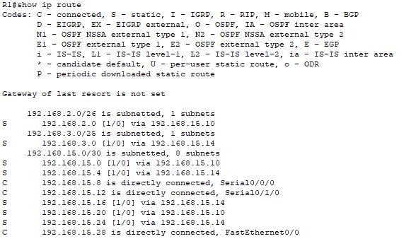
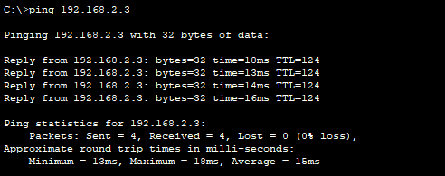
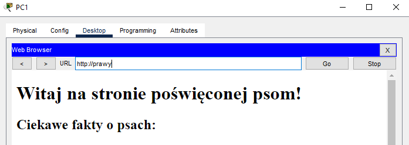
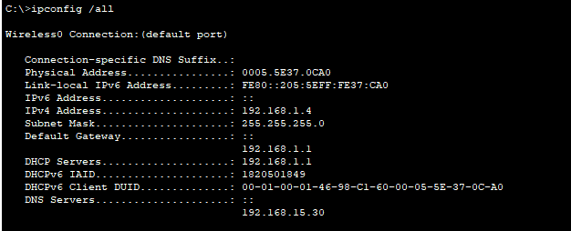
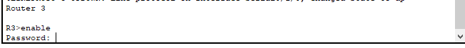

# Symulacja Sieci : Routing Statyczny, WiFi & Usługi Sieciowe (Cisco Packet Tracer)

<p align="center">
  
  <br>
  <em>Topologia logiczna sieci. Widoczny szkielet WAN oparty na trójkącie routerów (R1, R2, R3), strefy dostępowe LAN oraz segment bezprzewodowy WiFi.</em>
</p>

<p align="center">
    
    
    
    
</p>

## O Projekcie

Projekt przedstawia symulację rozległej sieci firmowej zrealizowaną w środowisku **Cisco Packet Tracer**. Celem było zaprojektowanie skalowalnej adresacji (VLSM), zapewnienie pełnej komunikacji między odseparowanymi sieciami LAN przy użyciu routingu statycznego oraz konfiguracja usług sieciowych (DNS, WWW) i bezpiecznego dostępu bezprzewodowego.

**Kluczowe funkcjonalności:**

- **Routing Statyczny:** Pełna komunikacja między 5 routerami brzegowymi (R1, R2, R3, R6, R7) z wykorzystaniem redundancji w topologii trójkąta.
- **Sieć Bezprzewodowa (WLAN):** Dwie strefy WiFi (Routery R4, R5) zabezpieczone standardem WPA2-PSK z obsługą DHCP dla klientów mobilnych.
- **Usługi Serwerowe:** Działająca infrastruktura DNS rozwiązująca nazwy domenowe (`lewy`, `prawy`) na adresy IP serwerów WWW.
- **Device Hardening:** Zabezpieczenie urządzeń sieciowych zgodnie z dobrymi praktykami (szyfrowanie haseł, banery MOTD).

---

## 1. Plan Adresacji (VLSM)

W projekcie wykorzystano technikę **VLSM**, co pozwoliło na optymalne wykorzystanie przestrzeni adresowej. Sieć została podzielona na logiczne segmenty o różnej wielkości masek podsieci:

| Strefa / Urządzenie     | Opis Roli                | Adres Sieci (CIDR)   | Maska Podsieci    | Brama (Gateway)     |
| :---------------------- | :----------------------- | :------------------- | :---------------- | :------------------ |
| **WiFi (Lewa strona)**  | Router R4 / Laptopy      | **192.168.2.0 /26**  | `255.255.255.192` | `192.168.2.1`       |
| **WiFi (Prawa strona)** | Router R5 / Laptopy      | **192.168.3.0 /25**  | `255.255.255.128` | `192.168.3.1`       |
| **WAN**                 | Połączenia Router-Router | **192.168.15.x /30** | `255.255.255.252` | N/A                 |
| **Serwery & LAN**       | PC1-PC4, WWW, DNS        | **192.168.x.x /24**  | `255.255.255.0`   | Zgodnie z topologią |

### 1.1. Szczegóły połączeń WAN

Routery połączone są dedykowanymi podsieciami `/30`, co zapewnia izolację i bezpieczeństwo routingu:

- **R1 ↔ R2:** `192.168.15.0/30`
- **R1 ↔ R3:** `192.168.15.4/30`
- **R2 ↔ R3:** `192.168.15.8/30`
- **Dostęp do R6/R7:** Podsieci `192.168.15.24/30` oraz `.28/30`

---

## 2. Konfiguracja Routingu Statycznego

Aby zapewnić pełną komunikację między odseparowanymi sieciami LAN i WiFi, na routerach brzegowych (R1, R2, R3, R6, R7) skonfigurowano **statyczne wpisy routingu**. Poniżej przedstawiono logikę dla głównego routera R1:

<p align="center">
  
  <br>
  <em>Tablica routingu (show ip route) na routerze R1 – widoczne trasy statyczne (oznaczone literą S).</em>
</p>

## 3. Konfiguracja Usług Sieciowych

### 3.1. Serwer DNS i Mapowanie Nazw

W sieci działa serwer DNS, który tłumaczy przyjazne nazwy domenowe na adresy IP serwerów WWW oraz stacji roboczych.

| Typ Rekordu | Nazwa Domenowa | Cel (IP)                 | Opis                       |
| :---------- | :------------- | :----------------------- | :------------------------- |
| **A**       | `lewy`         | `[IP Serwera WWW Lewy]`  | Strona intranetowa lewa    |
| **A**       | `prawy`        | `[IP Serwera WWW Prawy]` | Strona intranetowa prawa   |
| **A**       | `pc1` - `pc4`  | `[IP Hostów PC]`         | Adresacja stacji roboczych |

### 3.2. WiFi i DHCP

Routery R4 i R5 pełnią rolę serwerów DHCP dla klientów bezprzewodowych:

- **SSID:** Zgodne z dokumentacją projektową.
- **Zabezpieczenia:** WPA2-PSK.
- **Pula DHCP:** Automatyczne przydzielanie IP, Maski, Bramy i adresu DNS.

## 4. Bezpieczeństwo Urządzeń

Zastosowano procedury _Device Hardening_ na routerach (R1-R7) oraz switchach (S1-S3), aby zabezpieczyć infrastrukturę przed nieautoryzowanym dostępem fizycznym i zdalnym:

```bash
! Konfiguracja haseł i szyfrowania
enable secret cisco         ! Hasło uprzywilejowane (zaszyfrowane MD5)
service password-encryption ! Ukrywanie haseł tekstowych w konfiguracji

! Baner informacyjny (MOTD)
! Wyświetlany przy próbie logowania, pełni rolę prawną i informacyjną
banner motd

! Zabezpieczenie linii konsoli
line console 0
 password cisco
 login
```

### Testy łączności (Ping)

Pomyślna wymiana pakietów ICMP potwierdza poprawność tablic routingu na wszystkich routerach pośrednich.

<p align="center">
  
  <br>
  <em>Pomyślny test komendy PING potwierdzający pełną łączność w sieci (End-to-End).</em>
</p>

### Testy usług (Web Browser)

Wpisanie w przeglądarce adresu domenowego (np. `http://prawy`) skutkuje poprawnym rozwiązaniem nazwy przez DNS i otwarciem strony.

<p align="center">
  
  <br>
  <em>Działająca usługa HTTP oraz DNS – przeglądarka otwiera stronę serwera po wpisaniu nazwy.</em>
</p>

### Weryfikacja WiFi i DHCP

Laptopy automatycznie pobierają pełną konfigurację sieciową (adres IP, bramę, DNS) z routerów bezprzewodowych.

<p align="center">
  
  <br>
  <em>Wynik komendy ipconfig potwierdzający poprawne działanie serwera DHCP w sieci WiFi.</em>
</p>

### Bezpieczeństwo

Dostęp do urządzeń jest chroniony hasłem.

<p align="center">
  
  <br>
  <em>Weryfikacja zabezpieczeń – router wymaga hasła przy próbie wejścia.</em>
</p>

# Wymagania

- **Oprogramowanie:** Cisco Packet Tracer w wersji **8.2** lub nowszej
- **Plik projektu:** `projekt_sieci.pkt`
